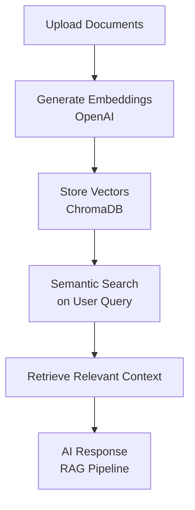

# AI Marketing Project – HALY TECH

## Overview

An AI assistant that turns your marketing documents into a fast, searchable knowledge base. It uses OpenAI embeddings and a vector database (ChromaDB) to retrieve relevant information instantly, and a RAG pipeline to generate context-aware responses. Built with FastAPI, LangChain, and a lightweight Vite frontend, the system minimizes lookup time, ensures consistent answers across teams, and helps businesses respond faster and make better decisions with immediate access to their own content.

---
## Quick Start

1. Clone the repository:
```bash
git clone https://github.com/Hadicheayto/ai-marketing-project
```

2. Install backend dependencies:
```bash
cd backend
pip install -r requirements.txt
```

3. Install frontend dependencies:
```bash
cd frontend
npm install
```

4. Start the backend server:
```bash
cd backend
uvicorn main:app --reload
```

5. Start the frontend development server:
```bash
cd frontend
npm run dev
```
---


## How It Works



---

## Why It Matters

Modern marketing depends on speed, accuracy, and instant access to information. This tool allows marketing teams to search their internal documents as easily as searching the web. It reduces time spent locating information, ensures consistent messaging, and enables faster responses to customers and stakeholders. By centralizing knowledge and automating retrieval, it strengthens engagement, shortens decision cycles, and improves overall productivity.

---
## Project Structure

```
ai-marketing-project/
├── backend/     # FastAPI server, RAG logic, document processing
├── frontend/    # Vite + Tailwind application
├── workflows/   # n8n automation flows
└── docs/        # Documentation and slides
```
---

## Features

- **Document Processing**: Upload and index PDF documents
- **Vector Storage**: Embedding and storage with ChromaDB
- **Semantic Search**: RAG-based information retrieval
- **Web Interface**: Fast, clean user interface
- **API Backend**: FastAPI server with OpenAI integration
- **Workflow Automation**: n8n-powered automation flows

---

## Tech Stack

**Backend**: FastAPI, Python, LangChain  
**AI Models**: OpenAI GPT + Embeddings  
**Vector Database**: ChromaDB  
**Automation**: n8n  
**Frontend**: Vite + Tailwind CSS  
**Development Tools**: GitHub Copilot

---

## Use Cases

- **Customer Support**: Automated responses to common queries
- **Product Information**: Quick retrieval of product details and specifications
- **Knowledge Management**: Centralized access to internal documents
- **Marketing Assistance**: Content creation and campaign support

---

*AI Marketing Assistant - Streamlining business intelligence and customer engagement through AI-powered document analysis.*

