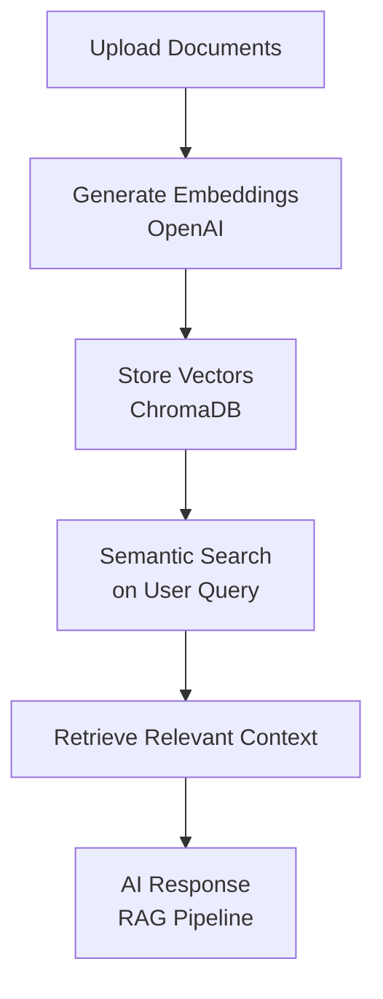

# AI Customer Support System
**HALY TECH**

## Overview
An intelligent AI support system that automates customer service workflows using RAG technology, dynamic ticket routing, and context-aware email generation.

---

## Key Capabilities

**Smart Knowledge Retrieval**
- RAG based chatbot answers customer questions using our uploaded documents
- OpenAI embeddings and ChromaDB ensure accurate, context-grounded responses

**Intelligent Ticket Management**
- Users submit issues with custom urgency levels (low/medium/high)
- Automated workflows via n8n route and prioritize requests appropriately

**Dynamic Email Automation**
- Every email is generated from the user's original query
- No static templates, ensuring relevant personalized communication at scale


---

## How It Works


---
## Quick Start
### Prerequisites
- Python 3.8+
- Node.js 16+
- OpenAI API key

### Setup
1. Clone the repository:
```bash
   git clone https://github.com/Hadicheayto/ai-marketing-project
   cd ai-marketing-project
```

2. Configure environment variables:
```bash
   # backend/.env
   OPENAI_API_KEY=your_key_here
   CHROMA_DB_PATH=./chroma_db
```

3. Install dependencies:
```bash
   # Backend
   cd backend && pip install -r requirements.txt
   
   # Frontend
   cd ../frontend && npm install
```

4. Run the application:
```bash
   # Terminal 1: Backend
   cd backend && uvicorn main:app --reload
   
   # Terminal 2: Frontend
   cd frontend && npm run dev
```
---
## Visual Walkthrough

### 1. Customer Support Interface

The frontend provides a real-time support experience where users can ask questions, upload attachments, and interact with the RAG based assistant.


### 2. Ticket Submission Flow

Users can create a support ticket by entering their information, describing the issue, and selecting an urgency level. The urgency level determines which automated workflow is triggered through n8n.


#### Urgency Logic:

**Low Urgency**
- Sends a single email with instructions to resolve the issue
- No additional actions are taken

**Medium Urgency**
- Sends an instructional email and asks whether the issue is resolved
- If resolved: workflow stops
- If not resolved: sends follow-up email with meeting invitation

**High Urgency**
- Sends an immediate meeting invitation
- No instructional email sent first

### 3. Automation Workflow (n8n)

This workflow orchestrates all backend automation: routing user requests, calling AI models, sending notifications, and generating meeting invitations.


---

## Tech Stack

**FastAPI** • **LangChain** • **OpenAI** • **ChromaDB** • **Vite** • **n8n**

**AI & Knowledge Base**  
OpenAI GPT + Embeddings • LangChain • ChromaDB for semantic search and RAG-based retrieval

**Backend & API**  
FastAPI • Python • RESTful endpoints for chat and ticket management

**Automation & Workflows**  
n8n for intelligent ticket routing and dynamic email generation

**Frontend**  
Vite • Tailwind CSS • Responsive web interface

**Document Processing**  
PDF upload and indexing • Vector embedding storage • Semantic search
---
## Project Folder Structure

```
ai-marketing-project/
├── backend/     # FastAPI server, RAG logic, document processing
├── frontend/    # Vite + Tailwind application
├── workflows/   # n8n automation flows
└── docs/        # Documentation and slides
```
---

